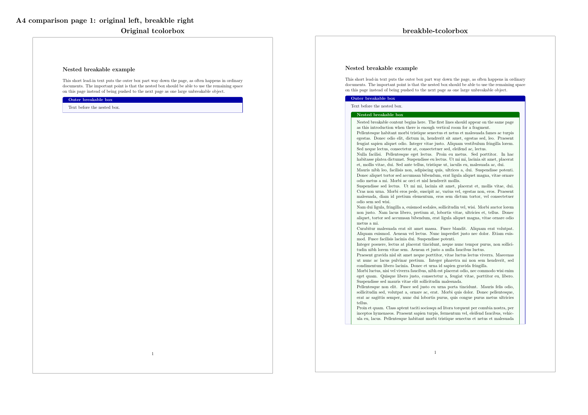
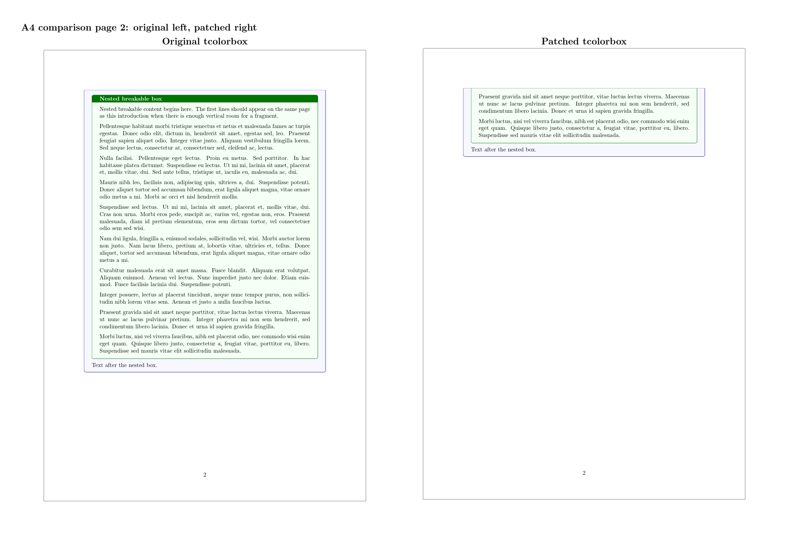

# breakble-tcolorbox

[English](README.md) | [日本語](README.ja.md)

`breakble-tcolorbox` は
[`tcolorbox`](https://github.com/T-F-S/tcolorbox) 6.10.0 をベースにした、非公式の改変版です。

公開されている `tcolorbox` の使い方との互換性を保ちながら、入れ子になった `breakable` box のページ分割を改善するためのパッケージです。親の `tcolorbox` が `breakable` のとき、その中に入れた通常の `breakable` な `tcolorbox` も、親のページ分割の流れに沿って自然に分割できるようにします。

このパッケージで大切にしていることは次のとおりです。

- 入れ子ではない通常の `tcolorbox` の出力は、元の `tcolorbox` と同じにする。
- upstream の example や manual source の出力も、元の `tcolorbox` と同じに保つ。
- `breakable` な box の中に長い `breakable` box を入れたとき、内側の box が丸ごと次ページへ送られて大きな空白を作るのではなく、今のページに残っている領域から自然に始まるようにする。

このリポジトリは upstream の `tcolorbox` 作者による公式配布物ではなく、upstream maintainer と提携しているものでもありません。

## まず使うなら

文書では、`tcolorbox` の代わりにこのパッケージを読み込みます。

```tex
\usepackage[most]{breakble-tcolorbox}
```

読み込んだ後は、いつもの `tcolorbox` の書き方をそのまま使います。

```tex
\begin{tcolorbox}[breakable,title={Outer box}]
  Text before the nested box.

  \begin{tcolorbox}[breakable,title={Nested box}]
    Long nested content...
  \end{tcolorbox}
\end{tcolorbox}
```

同じ文書で次のように両方を書くことは避けてください。

```tex
\usepackage{tcolorbox}
\usepackage{breakble-tcolorbox}
```

`breakble-tcolorbox` はラッパーパッケージです。`most`, `skins`, `breakable` などのオプションを、このリポジトリに入っている改変済み `tcolorbox` に渡して読み込みます。

## 見た目として何が変わるか

元の `tcolorbox` では、通常の入れ子になった `breakable` box は、実質的にはその場でページ分割できません。そのため、内側の box が今のページの残り部分に収まらないと、内側の box が丸ごと次のページへ送られ、ページ下部に大きな空白ができることがあります。

`breakble-tcolorbox` では、内側の box を親の `breakable` box のページ分割の流れに参加させます。そのため、内側の box の最初の断片が、今のページに残っている領域から始まります。

下の比較は、同じ A4 文書をコンパイルしたものです。左が元の `tcolorbox`、右が `breakble-tcolorbox` です。比較では、本文は同じまま、読み込むパッケージを切り替えています。

1ページ目では、元の `tcolorbox` がページ下部を大きく空けて内側の box を次ページへ送っている一方で、`breakble-tcolorbox` は同じページの残り領域から内側の box を始めています。2ページ目を見ると、右側の内側 box が実際にページをまたいで続いていることも確認できます。





同じ比較は PDF でも確認できます。

- `docs/readme-demo/nested-breakable-comparison.pdf`

サンプルの中心部分は、普通の `tcolorbox` の書き方です。

```tex
\begin{outerdemo}
Text before the nested box.

\begin{innerdemo}
Nested breakable content begins here.

% Long ordinary prose follows.
% 元の tcolorbox では、この内側 box が次ページへ送られます。
% breakble-tcolorbox では、ここから始まり、次ページへ続きます。
\end{innerdemo}

Text after the nested box.
\end{outerdemo}
```

このサンプルのソースは `docs/readme-demo/` に置いてあります。

- `nested-breakable-original.tex`: 元の `tcolorbox` を使う版
- `nested-breakable-breakble.tex`: `breakble-tcolorbox` を使う版
- `nested-breakable-body.tex`: 両者で共通の本文
- `nested-breakable-comparison.pdf`: 左に元の出力、右に `breakble-tcolorbox` の出力を並べた PDF

`breakble-tcolorbox` 版の冒頭は次のようになります。

```tex
\documentclass[a4paper,11pt]{article}
\usepackage[margin=24mm]{geometry}
\usepackage[most]{breakble-tcolorbox}

\input{nested-breakable-body.tex}
```

比較用の元版では、同じ本文に対して読み込み部分を次のようにしています。

```tex
\usepackage[most]{tcolorbox}
```

このリポジトリのルートからサンプル PDF を再生成する場合は、次のようにします。

```sh
cd docs/readme-demo
TEXINPUTS="$PWD:$PWD/../../vendor/tcolorbox-original//:" \
  latexmk -pdf -outdir=../../build/readme-demo/original nested-breakable-original.tex
TEXINPUTS="$PWD:$PWD/../..:$PWD/../../tcolorbox//:" \
  latexmk -pdf -outdir=../../build/readme-demo/breakble nested-breakable-breakble.tex
```

## どのファイルを使うのか

ユーザーが文書から直接読み込む入口は、次のファイルです。

- `breakble-tcolorbox.sty`

ただし、コンパイル時には次のディレクトリも必要です。

- `tcolorbox/`

この `tcolorbox/` ディレクトリは、upstream の実行時ファイルを元にした改変済みコピーです。中には `tcolorbox.sty`、`tcbbreakable.code.tex` や `tcbskins.code.tex` などのライブラリファイル、一部の skin が使う画像ファイルが入っています。

`tcolorbox/` は、ユーザーが文書内で直接読み込むものではありません。また、一部のファイルを抜き出して使うのも避けてください。`breakble-tcolorbox.sty` と `tcolorbox/` ディレクトリをセットで使う、という理解で大丈夫です。

文書内では、通常は次を読み込めば使えます。

```tex
\usepackage[most]{breakble-tcolorbox}
```

## 手動コピーで試す方法

TeX の探索パスを設定せずに試したい場合は、次のフォルダを使ってください。

- `drop-in/`

`drop-in/` の中には、コピー用の `breakble-tcolorbox/` フォルダが入っています。このフォルダを、コンパイルしたい `.tex` ファイルと同じ階層へコピーしてください。大量の `.sty` や `.code.tex` が文書フォルダ直下に散らばらないようにしています。

たとえば、次のような配置にします。

```text
your-document/
  main.tex
  breakble-tcolorbox/
    breakble-tcolorbox.sty
    tcolorbox.sty
    tcbbreakable.code.tex
    tcbskins.code.tex
    ...
```

この配置なら、文書側では次のように読み込みます。

```tex
\usepackage[most]{breakble-tcolorbox/breakble-tcolorbox}
```

この方法では、`TEXINPUTS` や `mktexlsr` は不要です。試用や、特定のプロジェクトで使いたい場合に向いています。

## プロジェクトごとに使う方法

ファイルを手動コピーせず、このリポジトリをそのまま置いて使いたい場合は、コンパイル時にこのリポジトリを TeX の探索パスの先頭に置きます。

```sh
TEXINPUTS="/path/to/breakble-tcolorbox//:" latexmk -pdf main.tex
```

たとえば、文書の隣にこのリポジトリを置いているなら、次のようにできます。

```sh
TEXINPUTS="../breakble-tcolorbox//:" latexmk -pdf main.tex
```

末尾の `//` は重要です。TeX に「このディレクトリ以下を再帰的に探す」と伝えるためのもので、これがないと `tcolorbox/` の中にある実行時ファイルが見つからないことがあります。

TeX がどのファイルを見つけるかは、次のように確認できます。

```sh
TEXINPUTS="/path/to/breakble-tcolorbox//:" kpsewhich breakble-tcolorbox.sty
TEXINPUTS="/path/to/breakble-tcolorbox//:" kpsewhich tcolorbox.sty
```

どちらも、このリポジトリ内のパスを指していれば問題ありません。

## 高度な方法: 個人用 TEXMF に入れる

毎回 `TEXINPUTS` を指定せずに使いたい場合は、個人用の TEXMF ツリーに入れる方法もあります。ただし、元の `tcolorbox` と文書ごとに使い分けたい人には、まず `drop-in/` 方式かプロジェクトごとの `TEXINPUTS` 方式をおすすめします。個人用 TEXMF は「自分の TeX 環境がいつも探しに行く、ユーザー専用の置き場所」です。

注意: この方法では、個人用 TEXMF の中に改変済みの `tcolorbox.sty` を置きます。そのため、TeX の探索順によっては、普通に

```tex
\usepackage{tcolorbox}
```

と書いた文書でも、この改変済み `tcolorbox` が本家より先に見つかることがあります。元の `tcolorbox` と `breakble-tcolorbox` を文書ごとに確実に使い分けたい場合は、個人用 TEXMF へ入れるより、`drop-in/` 方式または `TEXINPUTS` を使うプロジェクトごとの方法を選んでください。

要するに、個人用 TEXMF へのインストールは「自分の環境では、この改変済み `tcolorbox` を通常の `tcolorbox` として優先してもよい」と判断できる場合の方法です。

まず、個人用 TEXMF の場所を確認します。macOS でも Windows でも、TeX Live / MacTeX を使っているなら次のコマンドが基本です。

```sh
kpsewhich -var-value=TEXMFHOME
```

よくある場所は次のとおりです。実際の場所は必ず上の `kpsewhich` で確認してください。

| 環境 | よくある `TEXMFHOME` |
| --- | --- |
| macOS / MacTeX | `~/Library/texmf` |
| Linux / TeX Live | `~/texmf` |
| Windows / TeX Live | `C:\Users\<ユーザー名>\texmf` |

### macOS / Linux / TeX Live

```sh
TEXMFHOME="$(kpsewhich -var-value=TEXMFHOME)"
mkdir -p "$TEXMFHOME/tex/latex/breakble-tcolorbox"

cp breakble-tcolorbox.sty "$TEXMFHOME/tex/latex/breakble-tcolorbox/"
cp -R tcolorbox "$TEXMFHOME/tex/latex/breakble-tcolorbox/"
```

### Windows / TeX Live

PowerShell では次のようにできます。

```powershell
$TEXMFHOME = kpsewhich -var-value=TEXMFHOME
New-Item -ItemType Directory -Force "$TEXMFHOME\tex\latex\breakble-tcolorbox"

Copy-Item .\breakble-tcolorbox.sty "$TEXMFHOME\tex\latex\breakble-tcolorbox\"
Copy-Item .\tcolorbox "$TEXMFHOME\tex\latex\breakble-tcolorbox\" -Recurse
```

### Windows / MiKTeX

MiKTeX では、TeX Live と同じ `kpsewhich` 方式で分かる場合もありますが、MiKTeX Console でユーザー用の root directory を追加する方が分かりやすいことがあります。

1. 例として `C:\Users\<ユーザー名>\texmf` を作る。
2. その中に `tex\latex\breakble-tcolorbox` を作る。
3. `breakble-tcolorbox.sty` と `tcolorbox/` をそこへコピーする。
4. MiKTeX Console でその `texmf` フォルダを root directory として追加する。
5. MiKTeX Console で file name database を更新する。

コマンドで行う場合は、環境によって次のような操作になります。

```powershell
initexmf --register-root=C:\Users\<ユーザー名>\texmf
initexmf --update-fndb
```

### 確認

`TEXMFHOME` では、TeX Live なら通常はファイル名データベースの更新なしで見つかります。もし TeX が見つけてくれない場合は、次を実行してください。

```sh
mktexlsr "$TEXMFHOME"
```

最後に確認します。

```sh
kpsewhich breakble-tcolorbox.sty
kpsewhich tcolorbox.sty
```

この方法で入れた場合、`kpsewhich tcolorbox.sty` も `breakble-tcolorbox/tcolorbox/` 以下の改変済みファイルを指すことがあります。これは、ラッパーから改変済みの `tcolorbox.sty` を読み込む形で動くためです。元の `tcolorbox` を常に優先したい環境では、このインストール方法は避けてください。

より詳しく調べたい場合は、次の語句で検索すると情報にたどり着きやすいです。

- `TeX Live TEXMFHOME`
- `MacTeX TEXMFHOME Library texmf`
- `Windows TeX Live TEXMFHOME kpsewhich`
- `MiKTeX local texmf root`
- `MiKTeX register root update fndb`
- `mktexlsr texhash 違い`

## 高度な方法: システム全体の TEXMF に入れる

共有の TeX Live 環境に入れる場合は、`TEXMFLOCAL` を使います。

```sh
kpsewhich -var-value=TEXMFLOCAL
```

次の場所に、同じく `breakble-tcolorbox.sty` と `tcolorbox/` を置きます。

```text
<TEXMFLOCAL>/tex/latex/breakble-tcolorbox/
```

例:

```sh
TEXMFLOCAL="$(kpsewhich -var-value=TEXMFLOCAL)"
sudo mkdir -p "$TEXMFLOCAL/tex/latex/breakble-tcolorbox"
sudo cp breakble-tcolorbox.sty "$TEXMFLOCAL/tex/latex/breakble-tcolorbox/"
sudo cp -R tcolorbox "$TEXMFLOCAL/tex/latex/breakble-tcolorbox/"
sudo mktexlsr
```

ただし、この方法では、その TeX 環境でコンパイルする文書に対して、改変済み `tcolorbox` が本家より先に見つかる可能性があります。つまり、普通の `\usepackage{tcolorbox}` でも改変版が使われることがあります。環境全体に影響するため、チームや端末全体でこの挙動を使いたい場合に選んでください。元の `tcolorbox` と併用したい場合は、この方法はおすすめしません。

## 別パッケージの内部で `tcolorbox` が読み込まれる場合

ここは少し注意が必要です。

自分でプリアンブルの順番を調整できるなら、`tcolorbox` を内部で使うパッケージより前に `breakble-tcolorbox` を読み込んでください。

```tex
\usepackage[most]{breakble-tcolorbox}
\usepackage{some-package-that-uses-tcolorbox}
```

この場合、後からそのパッケージが `\RequirePackage{tcolorbox}` を実行しても、LaTeX から見ると `tcolorbox` はすでに読み込み済みです。つまり、`breakble-tcolorbox` が読み込んだ改変済み `tcolorbox` が使われます。

`drop-in/` 方式でフォルダごと置いている場合も考え方は同じです。

```tex
\usepackage[most]{breakble-tcolorbox/breakble-tcolorbox}
\usepackage{some-package-that-uses-tcolorbox}
```

この場合も、後から読み込まれるパッケージは改変済み `tcolorbox` を共有します。つまり、順番を調整できる文書では、`drop-in/` 方式や `TEXINPUTS` 方式を使えば、環境全体の普通の `tcolorbox` を置き換えず、その文書では改変版を使えます。

一方で、文書クラスやパッケージがプリアンブルより前、または `breakble-tcolorbox` より前に `tcolorbox` を読み込んでしまう場合、あとからラッパーで差し替えることはできません。その場合、その文書でどうしても改変版を使いたいなら、このリポジトリの `tcolorbox/` を本家 `tcolorbox` より先に TeX の探索パスへ置き、ラッパーは後から読み込まないでください。

```sh
TEXINPUTS="/path/to/breakble-tcolorbox/tcolorbox//:" latexmk -pdf main.tex
```

これにより、そのコンパイルでは、内部の `\RequirePackage{tcolorbox}` が改変済みの実行時ファイルを直接見つけます。次のコマンドや `.log` ファイルで、どの `tcolorbox.sty` が読まれているか確認してください。

```sh
TEXINPUTS="/path/to/breakble-tcolorbox/tcolorbox//:" kpsewhich tcolorbox.sty
```

また、後から読み込まれるパッケージが `tcolorbox` にオプションを渡す場合は、必要になりそうなライブラリを先に読み込んでおくと option clash を避けやすくなります。

```tex
\usepackage[most]{breakble-tcolorbox}
```

`most` はよく使われる `tcolorbox` ライブラリをまとめて読み込むため、多くの場合はこれで十分です。

## 基本情報

- ベース: `tcolorbox` 6.10.0, tag `v6.10.0`
- このコピーに使った upstream commit: `057ff62f77aeef399251ac4fca98d1a20c36ab32`
- ライセンス: upstream `tcolorbox` と同じく LPPL 1.3c or later
- メンテナンス: 非公式版です。upstream の `tcolorbox` 作者による保守物ではありません。

## 検証

開発中に固めた nested breakable の要件は `docs/nested-breakable-requirements.md` に残しています。

upstream の standalone example と manual source を、それぞれ次の 2 通りでコンパイルします。

- original `tcolorbox` 6.10.0
- この `breakble-tcolorbox` 配布版

生成されたページを pixel 単位で比較し、左に元の出力、右に breakble 版を並べた比較 PDF も生成します。

### PDF で確認できるもの

具体的な出力を見たい場合は、まず次の PDF を見てください。これらはリポジトリに含めてあります。

- `docs/readme-demo/nested-breakable-comparison.pdf`:
  README の説明に使っている基本の比較例です。左が元の `tcolorbox`、右が `breakble-tcolorbox` です。
- `verification/nested-behavior/pdf/a4-nested-behavior-side-by-side.pdf`:
  入れ子の `breakable` box が、元の `tcolorbox` と `breakble-tcolorbox` でどう違うかをケースごとに並べた比較 PDF です。
- `verification/nested-behavior/pdf/a4-nested-title-mix.pdf`:
  継続タイトルあり・なしが混ざる入れ子で、上下の余白や重なりが自然になるかを確認する PDF です。
- `verification/nested-behavior/pdf/a4-nested-title-mix-deep.pdf`:
  より深い入れ子で、継続タイトルあり・なしが混ざる場合を確認する PDF です。
- `verification/nested-behavior/pdf/a4-nested-breakable-stress.pdf`:
  途中ページから始まる box、タイトルなしの継続、多重入れ子、装飾付きの上下部分などをまとめて確認する PDF です。
- `verification/nested-behavior/pdf/a4-titleless-nesting-depths.pdf`:
  タイトルなしの入れ子を 2, 3, 4, 5, 6 段で確認する PDF です。
- `verification/nested-behavior/pdf/a4-titleless-reach-reference.pdf`:
  入れ子なしの通常の `tcolorbox` がページ下部へどこまで到達するかを見るための基準 PDF です。

upstream の standalone example については、左に元の出力、右に breakble 版を並べた比較 PDF があります。

- `verification/example-parity/side-by-side/tcolorbox-example/tcolorbox-example__original-side-by-side.pdf`
- `verification/example-parity/side-by-side/tcolorbox-example-poster/tcolorbox-example-poster__original-side-by-side.pdf`
- `verification/example-parity/side-by-side/tcolorbox-tutorial-poster/tcolorbox-tutorial-poster__original-side-by-side.pdf`

### マニュアル全体で確認する場合

upstream のマニュアル本文は、次のファイルです。

- `docs/tcolorbox/tcolorbox.tex`

このファイルから、`docs/tcolorbox/tcolorbox.doc.*.tex` の各断片が読み込まれます。改良版でマニュアル全体をコンパイルして確認する場合は、次を実行します。

```sh
scripts/check-upstream-manual-parity.py
```

実行後、主な出力は次の場所にできます。

- 改良版でコンパイルしたマニュアル:
  `verification/manual-parity/sources/breakble/tcolorbox.pdf`
- 元の `tcolorbox` でコンパイルしたマニュアル:
  `verification/manual-parity/sources/original/tcolorbox.pdf`
- 左に元の出力、右に breakble 版を並べたマニュアル比較 PDF:
  `verification/manual-parity/side-by-side/tcolorbox-manual/tcolorbox-side-by-side.pdf`
- 実行結果のレポート:
  `verification/manual-parity/report.md`

`verification/manual-parity/` は、マニュアル全体の PDF やレンダリング画像を含む生成物なので、Git では無視しています。手元で上のスクリプトを実行すると再生成されます。

nested behavior のレポート:

- `verification/nested-behavior/report.md`

standalone example parity のレポート:

- `verification/example-parity/report.md`

standalone example parity の再生成:

```sh
scripts/check-upstream-example-parity.py
```

manual parity の再生成:

```sh
scripts/check-upstream-manual-parity.py
```

公開用の検証スクリプトをまとめて実行:

```sh
scripts/run-full-verification.sh
```

これらのスクリプトは `latexmk`, `pdflatex`, `biber`, `makeindex`, `pdfinfo`, `pdftopng` を必要とします。`pygmentize` が `PATH` 上にない場合は、その実行中に使う Pygments を `/tmp` にインストールします。

## リポジトリ構成

- `breakble-tcolorbox.sty`: 文書から読み込む公開用ラッパーパッケージ
- `tcolorbox/`: ラッパーが読み込む改変済み実行時ファイル
- `vendor/tcolorbox-original/`: parity check 用の未改変 upstream 実行時ファイル
- `docs/nested-breakable-requirements.md`: nested breakable 挙動について開発中に固めた要件
- `docs/tcolorbox/`: parity check に使う upstream documentation、standalone example sources、assets
- `docs/readme-demo/`: README の比較画像に使う A4 サンプル
- `docs/samples/`: タイトルなし入れ子などの追加サンプル
- `drop-in/`: `.tex` と同じ階層へフォルダごとコピーして使うためのファイル一式
- `verification/example-parity/`: 生成済み parity report、source copies、side-by-side PDFs
- `verification/nested-behavior/`: nested breakable の確認用レポートと PDF
- `verification/manual-parity/`: 生成される manual parity report、source copies、rendered pages、side-by-side PDF

## Upstream

このパッケージは Thomas F. Sturm 氏の `tcolorbox` を元にしています。

Upstream project:
<https://github.com/T-F-S/tcolorbox>

このリポジトリは upstream maintainer と提携しておらず、upstream maintainer による承認を受けたものでもありません。
